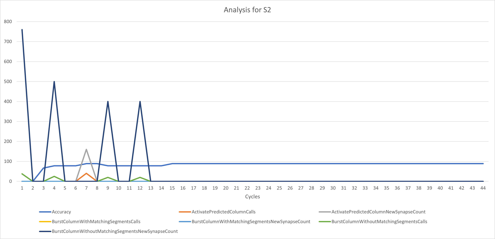
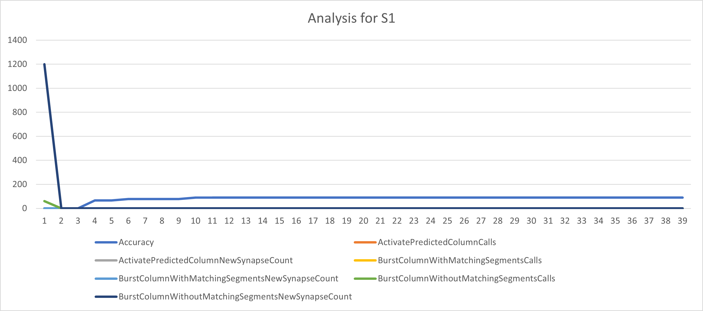
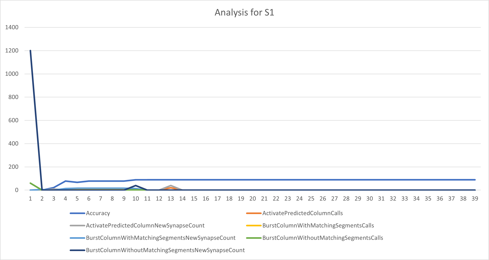
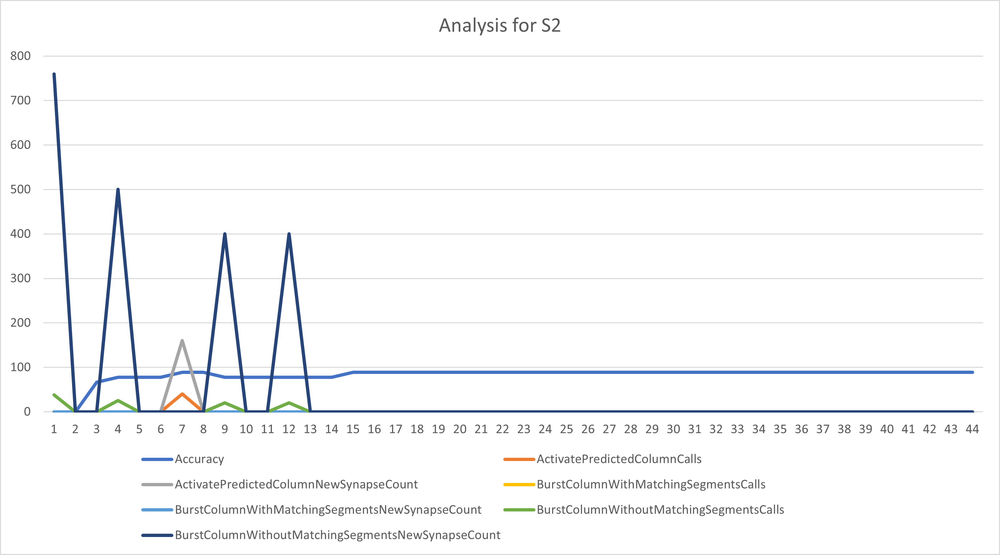
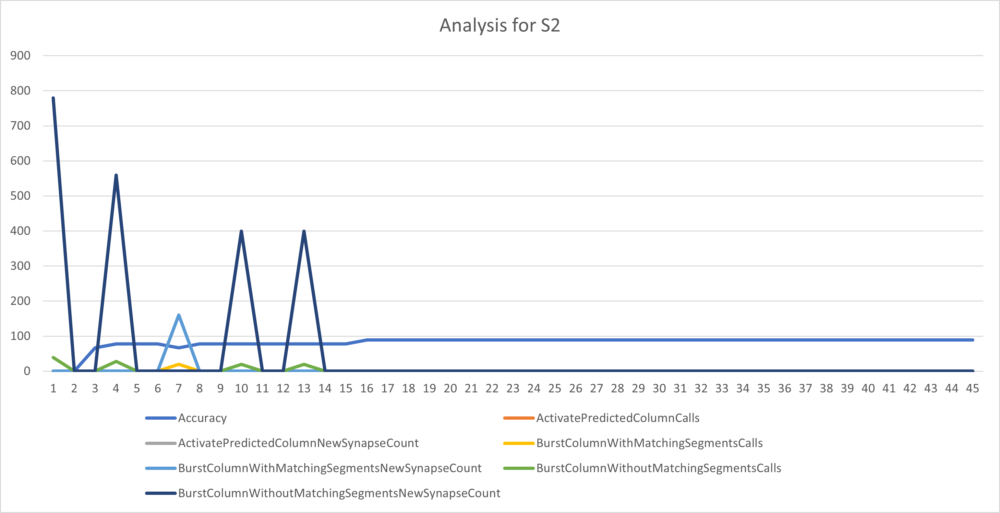
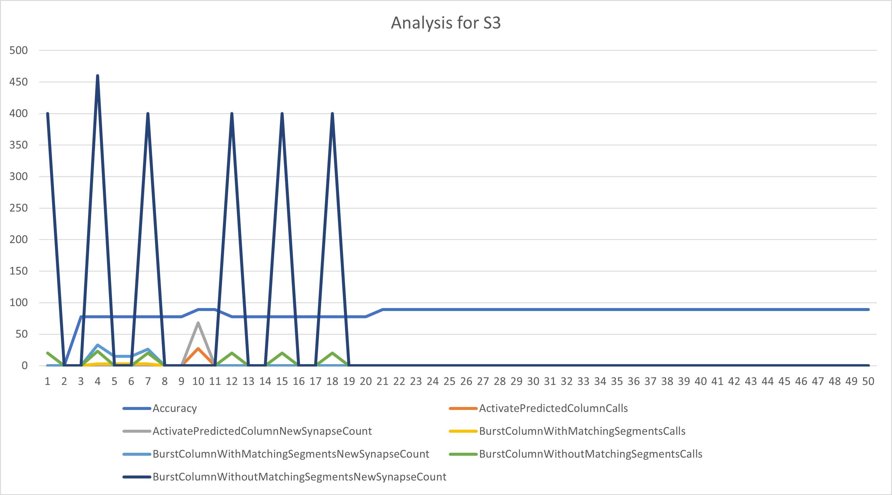
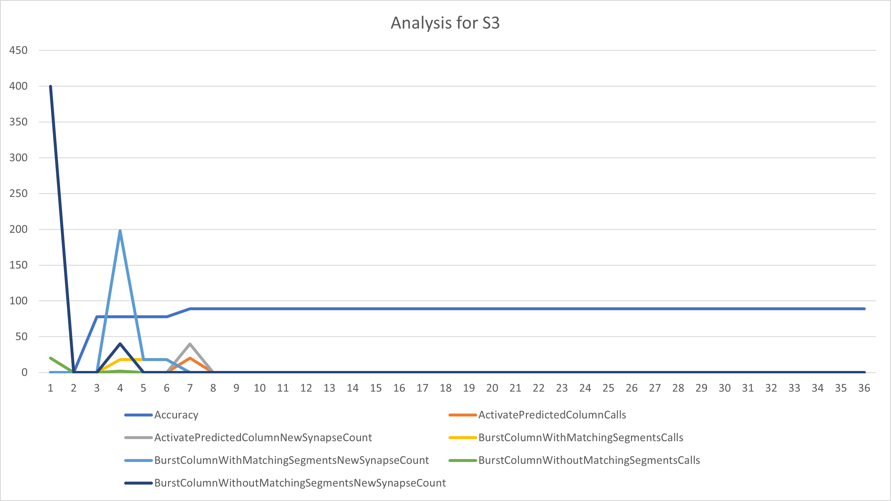

# ML22/23-13 Investigate Influence of parameter MaxNewSynapseCount

## Introduction

The parameter MaxNewSynapseCount plays a crucial role in the functioning of Hierarchical Temporal Memory (HTM) networks, particularly in the context of the Temporal Memory (TM) algorithm. This project aims to explore how variations in ```MaxNewSynapseCount``` affect learning efficacy and prediction accuracy within an HTM network specifically in ```Multisequencelearning```. Understanding this influence is pivotal for optimizing HTM configurations to enhance performance on specific tasks.

## Approach

Our work approach encompasses a comprehensive analysis, starting with a theoretical overview of HTM's TM algorithm and identifying the expected impact of ```MaxNewSynapseCount``` on ```Multisequencelearning``` and its ```Run()``` . We proceed with a systematic experimentation phase, wherein we alter ```MaxNewSynapseCount``` across a range of values and observe its effect on ```Multisequencelearning``` 's learning speed and prediction accuracy.

## Implementation details

A significant adjustment in our approach was the modification of the MultiSequenceLearning class, specifically to introduce flexibility in setting the MaxNewSynapseCount. This parameter controls the maximum number of new synapses the TM algorithm can create for each cell that becomes active during learning.

### Constructor Update
To facilitate experimental variation of ```MaxNewSynapseCount```, we modified the constructor of ```MultiSequenceLearning```:

```csharp
public MultiSequenceLearning(int maxNewSynapseCount)
{
    this.maxNewSynapseCount = maxNewSynapseCount;
}


```
This alteration allows each experiment run to specify a different ```MaxNewSynapseCount```, enabling a systematic analysis across a range of values.

### Experiment Configuration
Each experiment instance configures an HTM network with the given MaxNewSynapseCount, alongside other essential parameters within the HtmConfig setup:

```csharp
HtmConfig cfg = new HtmConfig(new int[] { inputBits }, new int[] { numColumns })
{
    // Other configuration settings omitted for brevity
    MaxNewSynapseCount = this.maxNewSynapseCount,
};

```
### Experiment Execution

The ```Program.cs``` file orchestrates the execution of learning experiments with varying ```MaxNewSynapseCount``` settings. For each experiment, a set of sequences is learned, and the system's predictive accuracy is evaluated.

Running Experiments with Different Parameters
Experiments are initiated with specific ```MaxNewSynapseCount``` values, allowing us to observe and compare the effects of this parameter on learning outcomes:

```csharp
RunMultiSequenceLearningExperiment(20);

```

### Data Logging and Result Generation

To capture the experiment outcomes, we introduced logging within the ```RunExperiment``` method of ```MultiSequenceLearning```. This includes writing the start time, ```MaxNewSynapseCount``` setting, cycle information, match accuracy, and the experiment's end time to a text file:

```csharp
using (StreamWriter writer = new StreamWriter(filePath, true))
{
    // Logging experiment details
    writer.WriteLine($"Experiment Start: {DateTime.Now}");
    writer.WriteLine($"MaxNewSynapseCount: {cfg.MaxNewSynapseCount}");
    // Additional details and results logging
}

```


### Understanding Multisequence Learning

```
01. Get HTM Config and initialize memory of Connections 
02. Initialize HTM Classifier and Cortex Layer
03. Initialize HomeostaticPlasticityController
04. Initialize memory for Spatial Pooler and Temporal Memory
05. Add Spatial Pooler memory to Cortex Layer
	05.01 Compute the SDR of all encoded segment for Multi-sequences using Spatial Pooler
	05.02 Continue for maximum number of cycles
06. Add Temporal Memory to Cortex Layer
    06.01 Compute the SDR as Compute Cycle and get Active Cells // at this part the MaxNewSynapseCount will be used in TM
	06.02 Learn the Label with Active Cells
	06.03 Get the input predicted values and update the last predicted value depending upon the similarity
	06.04 Reset the Temporal Memory
	06.05 Continue all above steps for sequences of Multi-sequences for maximum cycles
07. Get the trained Cortex Layer and HTM Classifier
```

### Understand TM and identify where `MaxNewSynapseCount` is being used 


## MaxNewSynapseCount usage details:

1. Identify where `MaxNewSynapseCount` is used in TM: `ActivatePredictedColumn()` and `BurstColumn()` which in the end calls `GrowSynapses()` depending on the condition of Active Segment and Matching Segments

2. Added logger in `TemporalMemory.cs` and log the calls for `GrowSynapses()` and by which condition it is called

```csharp

public List<String> Logger { get; set; }
public int countLogger { get; set; }
:        :            :
:        :            :

//in GrowSynapses()
this.Logger.Add($"GrowSynapses(): calledBy: {calledBy}, requiredNewSynapses: {requiredNewSynapses}, numMissingSynapses: {numMissingSynapses}");
this.countLogger++;
//use above variable as per each cycle is changes
```

3. Create report and analysis in `MultisequenceLearning.cs`

```csharp
if (tm.countLogger > previousCountLogger)
{
	foreach(String item in tm.Logger)
	{
		CreateReport();
		CreateAnalysis();
	}
}
```

Note: CreateReport() and CreateAnalysis() are actucal lines of code and for simplicity we have ommited it

For report the model is as shown as below:

```csharp
public class Report
{

    public int cycle;                 // cycle number
    public string sequenceName;       // sequence name
    public List<String> logs;         // list actual log for TM in a cycle
    public double accuracy;           // accuracy of the cycle

}
```

For analysis the model is shown as below:

```csharp
public class Analysis
{
    public int Cycle { get; set; }                                              // cycle number
    public string SequenceName { get; set; }                                    // sequence name
    public double Accuracy { get; set; }                                        // accuracy of the cycle
    public int ActivatePredictedColumnCalls { get; set; }                       // number of call made by ActivatePredictedColumn()
    public int ActivatePredictedColumnNewSynapseCount { get; set; }             // total number of synapses grown by call of ActivatePredictedColumn()
    public int BurstColumnWithMatchingSegmentsCalls { get; set; }               // number of call made by BurstColumnWithMatchingSegments()
    public int BurstColumnWithMatchingSegmentsNewSynapseCount { get; set; }     // total number of synapses grown by call of BurstColumnWithMatchingSegments()
    public int BurstColumnWithoutMatchingSegmentsCalls { get; set; }            // number of call made by BurstColumnWithoutMatchingSegments()
    public int BurstColumnWithoutMatchingSegmentsNewSynapseCount { get; set; }  // total number of synapses grown by call of BurstColumnWithoutMatchingSegments()
}
```

## Results

The reports and analysis is store in base path of app domain (`AppDomain.CurrentDomain.BaseDirectory`) which has `reports` and `analysis` directory having all the outputs.

Further more,

1. `MaxNewSynapseCount` value changes in `ActivatePredictedColumn()` if we have active column and active segment and the positive difference in `MaxNewSynapseCount` and active potential synapse is _addition of synapse_

2. `MaxNewSynapseCount` value changes in `BurstColumn()` if we have active column and no active segment and the positive difference in `MaxNewSynapseCount` and last active potential synapse is _addition of synapse_

3. The accuracy of each cycle changes (goes up usually) even if we do not add any new synapses, but it does not assure that adding synapses with increase the accuracy


### Report

The report shows all the calls made for calling `GrowSynapses()` and the number of syanpses added:

```
----------------------------- Start of Cycle: 210 -----------------------------
Cycle: 210, Sequence: S1, Accuracy: 0
	GrowSynapses(): calledBy: BurstColumnWithMatchingSegments, requiredNewSynapses: 2, numMissingSynapses: 2, input: 4
	GrowSynapses(): calledBy: BurstColumnWithMatchingSegments, requiredNewSynapses: 1, numMissingSynapses: 1, input: 4
	GrowSynapses(): calledBy: BurstColumnWithoutMatchingSegments, requiredNewSynapses: 2, numMissingSynapses: 2, input: 5
	GrowSynapses(): calledBy: BurstColumnWithoutMatchingSegments, requiredNewSynapses: 1, numMissingSynapses: 1, input: 5
----------------------------- End of Cycle: 210 -----------------------------
----------------------------- Start of Cycle: 211 -----------------------------
Cycle: 211, Sequence: S1, Accuracy: 22.22222222222222
	GrowSynapses(): calledBy: ActivatePredictedColumn, requiredNewSynapses: 2, numMissingSynapses: 2, input: 4
	GrowSynapses(): calledBy: ActivatePredictedColumn, requiredNewSynapses: 1, numMissingSynapses: 1, input: 4
	GrowSynapses(): calledBy: ActivatePredictedColumn, requiredNewSynapses: 4, numMissingSynapses: 4, input: 5
	GrowSynapses(): calledBy: ActivatePredictedColumn, requiredNewSynapses: 3, numMissingSynapses: 3, input: 5
----------------------------- End of Cycle: 211 -----------------------------
----------------------------- Start of Cycle: 212 -----------------------------
Cycle: 212, Sequence: S1, Accuracy: 77.77777777777779
	GrowSynapses(): calledBy: BurstColumnWithMatchingSegments, requiredNewSynapses: 7, numMissingSynapses: 7, input: 4
	GrowSynapses(): calledBy: BurstColumnWithMatchingSegments, requiredNewSynapses: 7, numMissingSynapses: 7, input: 4
	GrowSynapses(): calledBy: ActivatePredictedColumn, requiredNewSynapses: 2, numMissingSynapses: 2, input: 5
	GrowSynapses(): calledBy: ActivatePredictedColumn, requiredNewSynapses: 1, numMissingSynapses: 1, input: 5
----------------------------- End of Cycle: 212 -----------------------------
```

1. calledBy: ActivatePredictedColumn

It means that there where some Active Segments and even though there were some Active Segments, new synapses can be added that connect previously active cells with the segment in `ActivatePredictedColumn()`. If the difference b/w `MaxNewSynapseCount` and last potential actice cells is positive we grow that many synapses.

2. calledBy: BurstColumnWithMatchingSegments

It means that there were no Active Segments and we need to active random cell in `BurstColumn()`.  We adapt segment and check for matching segment and if the positive difference b/w `MaxNewSynapseCount` and last potential active synapse is positive we grow that many synapses.

3. calledBy: BurstColumnWithoutMatchingSegments

It means that there were no Active Segments and we need to active random cell in `BurstColumn()`.  We adapt segment and if no matching segment then we calcuate the minimum b/w `MaxNewSynapseCount` and previous winner cell count to grow the synapses

The all reports can be found here: [output/reports](output/reports/)

### Analysis

We save number of calls made by ActivatePredictedColumn or BurstColumnWithMatchingSegments or BurstColumnWithMatchingSegments and the number of synapses increased for all sequence per cycle.
The following image shows visual representation of change happening for a sequence in all its cycles. These are saved as CSV files.

Below is an exmaple where analysis of S2 is done and the various times various function calls and toal number of synapse grown in the cycle is created from the CSV data when converted to line graph.



The X-axis has number of cycles of learning with SP+TM and the Y-axis is count for various values. The accuracy is limited to 100 and rest of the counts are the number of times the function is called and the number of synapse is added. 

So if we want to evaluate the above image, burst column without matching segment is called initally and the synapse growth is high in earlier cycles and gradually it goes down. 


Usually when burst column without matching segment is called the synapse count increasing per input is equal to MaxNewSynapseCount which can be observer in the report file.

The all analysis can be found here: [output/analysis](output/analysis/)


### Comparision between 2 different runs with same data

|Sequence Name|Run 1|Run 2|
|-|-|-|
|S1|||
|S2|||
|S3|||

Above charts show the analysis for running and anlysing same data sequences but in differnt runs.

S1 and S2 have shown similarity in changes in adding synapse and number of calls which were made, but in S3 its totally different even with same data. 
