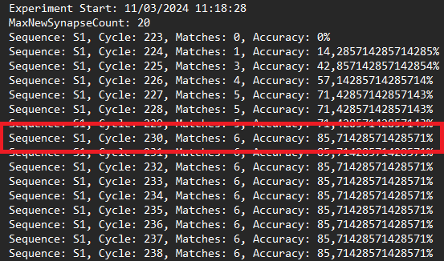

# ML22/23-13 Investigate Influence of parameter MaxNewSynapseCount

## Introduction

The parameter MaxNewSynapseCount plays a crucial role in the functioning of Hierarchical Temporal Memory (HTM) networks, particularly in the context of the Temporal Memory (TM) algorithm. This project aims to explore how variations in ```MaxNewSynapseCount``` affect learning efficacy and prediction accuracy within an HTM network specifically in ```Multisequencelearning```. Understanding this influence is pivotal for optimizing HTM configurations to enhance performance on specific tasks.

## Brief Summary

- **Investigated the Influence of `MaxNewSynapseCount` Parameter**: Explored how different settings of `MaxNewSynapseCount` impact the learning efficiency and prediction accuracy in Hierarchical Temporal Memory (HTM) networks.

- **Modified the `MultiSequenceLearning` Class**: Adapted the constructor to accept `MaxNewSynapseCount` as a parameter, allowing dynamic experimentation with various synapse counts.

- **Conducted Systematic Experiments**: Performed a series of experiments with varying `MaxNewSynapseCount` values to observe the parameter's effect on the network's ability to learn and predict sequences.

- **Implemented Detailed Logging**: Enhanced the experiment code to log detailed information about each run, including start and end times, configuration settings, learning cycles, and accuracy results.

- **Analyzed Learning Speed and Prediction Accuracy**: Compared the number of learning cycles required and the prediction accuracy achieved at different `MaxNewSynapseCount` settings.

- **Generated Comparative Results**: Produced tables summarizing the learning speed and prediction accuracy across various `MaxNewSynapseCount` settings, providing clear insights into the parameter's impact.

- **Utilized the NeoCortexApi Framework**: Leveraged the capabilities of the NeoCortexApi to simulate HTM networks and implement the temporal memory algorithm with custom `MaxNewSynapseCount` settings.

- **Observed Performance Trends**: Identified trends in how increased `MaxNewSynapseCount` values can lead to faster learning and higher accuracy, albeit with diminishing returns at higher settings.

- **Drew Key Conclusions**: Concluded that `MaxNewSynapseCount` is a critical parameter for optimizing HTM networks, with a significant influence on learning capabilities and prediction performance.

- **Laid Groundwork for Future Work**: Established a foundation for further exploration into HTM parameter tuning, suggesting avenues for additional studies on other HTM configurations and their effects on network performance possible over the Cloud as in the local machine it consumes more resources.


## Architecture:


Flow Chart of the work process:


Figure: Work process flow chart

Temporal Memory Architecture:


## Approach

Our work approach encompasses a comprehensive analysis, starting with a theoretical overview of HTM's TM algorithm and identifying the expected impact of ```MaxNewSynapseCount``` on ```Multisequencelearning``` and its ```Run()``` . We proceed with a systematic experimentation phase, wherein we alter ```MaxNewSynapseCount``` across a range of values and observe its effect on ```Multisequencelearning``` 's learning speed and prediction accuracy.

## Implementation details

A significant adjustment in our approach was the modification of the MultiSequenceLearning class, specifically to introduce flexibility in setting the MaxNewSynapseCount. This parameter controls the maximum number of new synapses the TM algorithm can create for each cell that becomes active during learning.

### Constructor Update
To facilitate experimental variation of ```MaxNewSynapseCount```, we modified the constructor of ```MultiSequenceLearning```:

```csharp
public MultiSequenceLearning(int maxNewSynapseCount)
{
    this.maxNewSynapseCount = maxNewSynapseCount;
}


```
This alteration allows each experiment run to specify a different ```MaxNewSynapseCount```, enabling a systematic analysis across a range of values.

### Experiment Configuration
Each experiment instance configures an HTM network with the given MaxNewSynapseCount, alongside other essential parameters within the HtmConfig setup:

```csharp
HtmConfig cfg = new HtmConfig(new int[] { inputBits }, new int[] { numColumns })
{
    // Other configuration settings omitted for brevity
    MaxNewSynapseCount = this.maxNewSynapseCount,
};

```
### Experiment Execution

The ```Program.cs``` file orchestrates the execution of learning experiments with varying ```MaxNewSynapseCount``` settings. For each experiment, a set of sequences is learned, and the system's predictive accuracy is evaluated.

Running Experiments with Different Parameters
Experiments are initiated with specific ```MaxNewSynapseCount``` values, allowing us to observe and compare the effects of this parameter on learning outcomes:

```csharp
RunMultiSequenceLearningExperiment(20);

```

### Data Logging and Result Generation

To capture the experiment outcomes, we introduced logging within the ```RunExperiment``` method of ```MultiSequenceLearning```. This includes writing the start time, ```MaxNewSynapseCount``` setting, cycle information, match accuracy, and the experiment's end time to a text file:

```csharp
using (StreamWriter writer = new StreamWriter(filePath, true))
{
    // Logging experiment details
    writer.WriteLine($"Experiment Start: {DateTime.Now}");
    writer.WriteLine($"MaxNewSynapseCount: {cfg.MaxNewSynapseCount}");
    // Additional details and results logging
}

```

## Run the Project

In order to run the project, the project [repository](https://github.com/Fathir-shishir/neocortexapi) can be cloned in the local system. After that, go to the source folder
(Make sure to checkout the branch team_AS) [for that open command prompt in the root folder run ```git checkout team_AS```] 


Open MySEProject


Now open EffectMaxNewSynapseCount->EffectMaxNewSynapseCount->EffectMaxNewSynapseCount.sln

 **->** 

Now open the Solution in Visual Studio and open the solution explorer


Build the solution from this menu


Now choose EffectMaxNewSynapseCount from upper menu and run the project, here inside the ```RunMaultiSequenceLearning``` the parameter passed 20 is the number of MaxNewSynapseCount set by default 


You can see the project starts running and creating log files


After the project run is complete go to the directory EffectMaxNewSynapseCount->bin->debug->net6.0


Now choose the text file named `experiment_results_20.txt` because we run the project at 20 MaxNewSynapseCount, the file name changes accordingly with this parameter value


After opening the txt file we can see the logs and results of predictions and how quickly it takes the Algorithm to peak the accuracy at the given MaxNewSynapsCount



Now to run the automated tests by which we can compare which MaxNewSynapseCount is better than which just go to Visual Studio and Open the Test explorer and run any given tests. Here you can see between the parameter value 5 and 20, 20 is better which is shown in the test results


## Results

The results we have found after running the MultiSequenceLearning Algorithm are given below for Given S1, S2 values:

```
{ "S1", new List<double>(new double[] { 0.0, 1.0, 0.0, 2.0, 3.0, 4.0, 5.0, 6.0, 5.0, 4.0, 3.0, 7.0, 1.0, 9.0, 12.0, 11.0, 12.0, 13.0, 14.0, 11.0, 12.0, 14.0 }) },
{ "S2", new List<double>(new double[] { 0.8, 2.0, 0.0, 3.0, 3.0, 4.0, 5.0, 6.0, 5.0, 7.0, 2.0, 7.0, 1.0, 9.0, 11.0, 11.0, 10.0, 13.0, 14.0, 11.0, 7.0, 6.0 }) }
```

| MaxNewSynapseCount | Cycles to Stabilize |
|--------------------|---------------------|
| 10                 | Leraning didn't happen|
| 20                 | 230                 |
| 30                 | 267                 |
| 40                 | 301                 |
| 50                 | 234                 |

| MaxNewSynapseCount | Accuracy (%) |
|--------------------|--------------|
| 10                 | didn't learn |
| 20                 | 85.7         |
| 30                 | 83.2         |
| 40                 | 85.7         |
| 50                 | 85.7         |

Here we can see in terms of Cycle count and accuracy, `MaxNewSynapseCount` value `20` performs better

for given input of S1, S2 values changed we get a different results
```
{ "S1", new List<double>(new double[] { 0.0, 1.0, 0.0, 2.0, 3.0, 4.0, 5.0 }) }, 
{ "S2", new List<double>(new double[] { 8.0, 1.0, 2.0, 9.0, 10.0, 7.0, 11.00 }) }
```

| MaxNewSynapseCount | Cycles to Stabilize |
|--------------------|---------------------|
| 10                 | 256                 |
| 20                 | 238                 |
| 30                 | 216                 |
| 40                 | 234                 |
| 50                 | 227                 |

| MaxNewSynapseCount | Accuracy (%) |
|--------------------|--------------|
| 10                 | 93.3         |
| 20                 | 93.7         |
| 30                 | 90.2         |
| 40                 | 93.7         |
| 50                 | 93.7         |

Here from the above result we can see that almost all the parameter performs identically when given a small input to learn. So in terms of the optimal parameter value of `MaxNewSynapseCount` 50 looks better.


